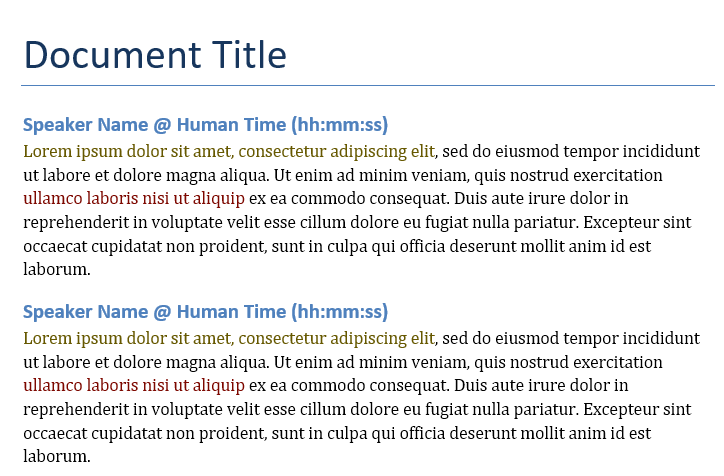

# Winston

> An Amazon Transcribe (JSON) to Word (docx) converter for multi-speaker transcriptions

A small script to help convert a multi-speaker Amazon Transcribe JSON to Word Document (docx).

Given a JSON transcript, a Word document with clean output is produced. Output is organised by speaker and time, followed by what was said by each speaker. Phrases are colored based on the transcription confidence from Amazon Transcribe.

I don't really plan on maintaining this, just thought it might be useful to others. Feel free to open a PR, though.

## Running

1. First install the requirements: `{however you run python} -m pip install -r requirements.txt`
2. Update the desired input and output attributes at the bottom of the file `transcribe.py`, under `if __name__ == "__main__":`
   1. The transcript JSON location
   2. The output document title
   3. The mapping of speakers in the file to the desired speaker name (**must match the speaker IDs in the file, e.g. `spk_0`**)
3. Run the script with  `{however you run python} transcribe.py`

## Example output

## Improvements

1. Consider adding filtering for certain phrases and words (e.g. removing "um"s)
2. Consider adding conditional formatting (e.g. bold for proper nouns)
3. Move from variable-based arguments to actual script arguments (e.g. with `argparse`)